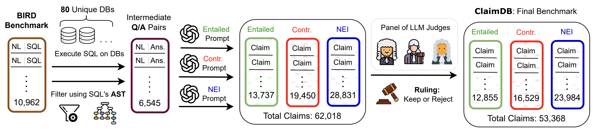

# ClaimDB: A Fact Verification Benchmark over Large Structured Data


<!-- WARNING: THIS FILE WAS AUTOGENERATED! DO NOT EDIT! -->

📢 **News:** Accepted to **ACL 2026**! 🎉

[](https://aclanthology.org/2026.acl-long.1589/)
[](https://claimdb.github.io/)
[](https://huggingface.co/datasets/michaeltheologitis/claimdb)
[](https://creativecommons.org/licenses/by-sa/4.0/)



## Overview

Given a **claim** (+extra info) and a **database**, the task is to
classify each claim as `ENTAILED`, `CONTRADICTED`, or `NOT ENOUGH INFO`
based on the evidence of the database. There are no restrictions on how
to interact with the database.

Please visit our [website](https://claimdb.github.io/) for more
information! From downloading the benchmark, viewing the LLM
leaderboard, to exploring individual claims and seeing the ClaimDB
statistics!

## Project Structure

    claimdb/
    ├── claimdb/                 # Main Python package (exported from notebooks)
    ├── nbs/                     # ClaimDB creation (0-7) + experiments and plots (7-8) notebooks 
    ├── experiments/             # Full experiment logs/traces and results
    │   └── public/              # Public test results
    ├── filter-data/             # Filtered/processed data
    │   ├── embeddings/          # Embedding files
    │   └── judges/              # Judge outputs
    ├── original-data/           # Raw source data
    │   └── BIRD/                # BIRD dataset (databases not available here)
    ├── final-benchmark/         # Final benchmark splits (train/test)
    ├── pyproject.toml           # Project config (UV/pip)
    ├── settings.ini             # nbdev configuration
    └── uv.lock                  # UV lockfile

## Citation

``` bibtex
@inproceedings{theologitis-etal-2026-claimdb,
    title = "{C}laim{DB}: A Fact Verification Benchmark over Large Structured Data",
    author = "Theologitis, Michael  and
      Dammu, Preetam Prabhu Srikar  and
      Shah, Chirag  and
      Suciu, Dan",
    editor = "Liakata, Maria  and
      Moreira, Viviane P.  and
      Zhang, Jiajun  and
      Jurgens, David",
    booktitle = "Proceedings of the 64th Annual Meeting of the {A}ssociation for {C}omputational {L}inguistics (Volume 1: Long Papers)",
    month = jul,
    year = "2026",
    address = "San Diego, California, United States",
    publisher = "Association for Computational Linguistics",
    url = "https://aclanthology.org/2026.acl-long.1589/",
    doi = "10.18653/v1/2026.acl-long.1589",
    pages = "34428--34451",
    ISBN = "979-8-89176-390-6"
}
```

## Contact

For questions or issues, please visit our
[website](https://claimdb.github.io/) or open an issue in this
repository.
